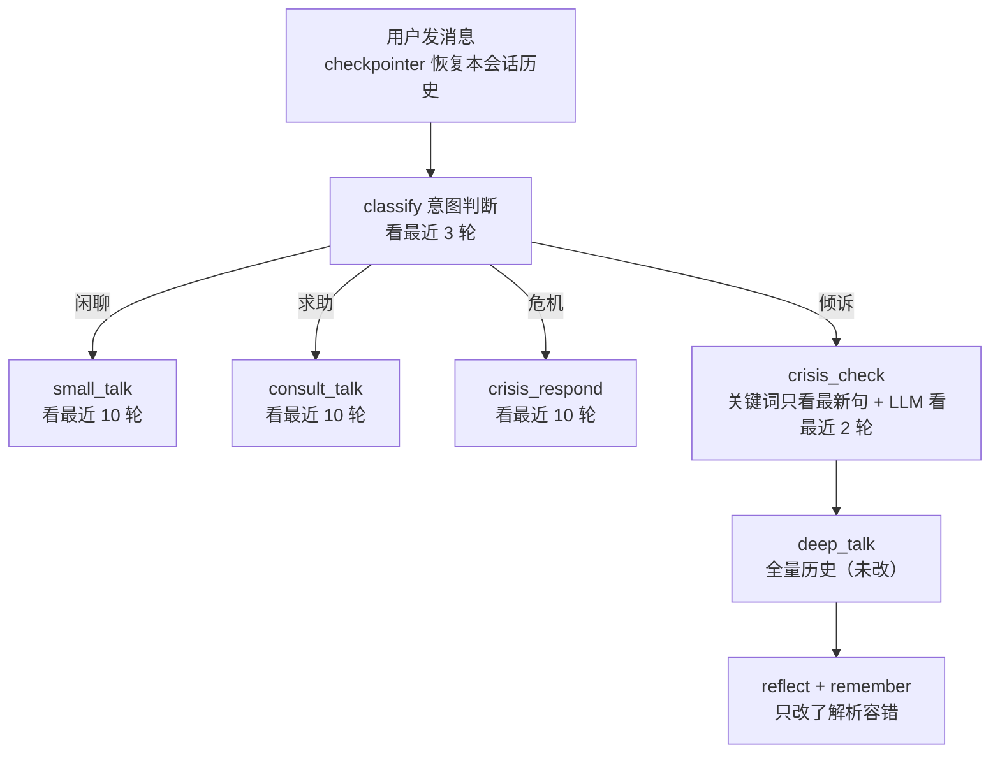

# WeTalk_v3 代码知识文档 v1（读懂已修改的内容）

> 日期：2026-09-07
> 目的：**让不熟悉代码的人也能看懂 v3 相对 v2 改了什么、为什么改、代码在哪里**。
> 范围：只覆盖已落地的修改——①短期记忆优化（所有意图节点能看历史）②结构化输出容错解析。
> 阅读对象：项目的维护者 / 想理解代码的人。

---

## 1. 版本背景

WeTalk_v3 是从 WeTalk_v2 完整复制出来的新版本（排除了 `local_models/`、旧 `data/`、`.git`）。
两轮修改都只落在**一个主文件**里：`graph/nodes.py`（所有对话节点）。

修改清单：

1. 新增历史上下文工具 `_recent_context`，让闲聊 / 求助 / 危机回应 / 意图判断 / 危机复核
   在调用大模型时能看到最近的对话历史；
2. 新增 `_parse_model_json` 容错解析，解决大模型返回"数组 / 代码块 / 前后缀文字"导致
   `with_structured_output` 崩溃的问题；
3. 更新了 `_last_user_message` 的注释，明确它只服务于"单句任务"。

其余（长期记忆读写、知识库检索、前端）本轮未动。

---

## 2. 读代码前需要懂的 4 个概念

### 2.1 State：所有节点的"共享工作台"

LangGraph 的 State 是一个字典。本项目里最重要的字段是 `messages`：
它保存**完整对话历史**——用户消息、AI 回复、工具结果都在里面。

短期的"会话记忆"就靠它：`SqliteSaver`（checkpointer）把每次运行后的 State 存档到 SQLite，
同一个 `thread_id` 下次调用时自动恢复，消息就"累积"起来了。

### 2.2 三种消息类型

| 类型 | 谁产生的 | 举例 |
|---|---|---|
| `HumanMessage` | 用户 | "我叫小周" |
| `AIMessage` | 助手 | "你好，小周！"；也可能是"请求调用工具" |
| `ToolMessage` | 工具执行后 | BM25 检索返回的知识片段 |

注意：`AIMessage` 如果带了 `tool_calls`（请求调工具），后面必须跟着对应的 `ToolMessage`，
这对"消息对"不能拆散——拆散了模型会看不懂，甚至报错。

### 2.3 "轮"（round）的定义

本文档里的"轮"指：**从一条用户消息开始，到下一次用户消息之前结束**。
例如"用户问 + 助手答"算一轮，"用户问 + 助手调工具 + 工具返回 + 助手最终答"也算一轮。

### 2.4 大模型的结构化输出可能不稳

`classify_node` 这类节点需要模型输出固定结构（如 `{"intent": "倾诉"}`）。
实际运行中模型偶尔会返回：

- 数组：`[{"intent": "倾诉"}]`
- 代码块：```` ```json {"intent": "倾诉"} ``` ````
- 前后缀文字：`判断结果如下：{"intent": "倾诉"}`

这就是要做"容错解析"的原因。

---

## 3. 文件地图：改了什么、在哪里

| 代码位置 | 函数 | 作用 |
|---|---|---|
| nodes.py 顶部 | `_context_chars` | 统计消息总字数（超长截断用） |
| nodes.py 顶部 | `_recent_context` | **核心**：从完整历史里截"最近 N 轮"消息 |
| nodes.py 顶部 | `_parse_model_json` | **核心**：把模型文本容错解析成 Pydantic 对象 |
| nodes.py 顶部 | `_last_user_message` | 取最新一句用户消息（单句任务用） |
| classify_node | — | 意图判断：注入最近 3 轮历史 |
| crisis_check_node | — | 危机复核：关键词快检不变；LLM 复核注入最近 2 轮 |
| small_talk_node | — | 闲聊：注入最近 10 轮历史 |
| consult_talk_node | — | 知识问答：注入最近 10 轮历史 |
| crisis_respond_node | — | 危机回应：注入最近 10 轮历史 |
| deep_talk_node | — | **未改**：保持全量历史 |
| reflect_node / remember_node | — | 仅把结构化输出调用换成容错解析，逻辑不变 |

---

## 4. 核心一：`_recent_context` 是怎么截历史的

### 4.1 它想解决什么问题

优化前：闲聊 / 求助 / 危机回应节点构造 prompt 时**只传最新一句用户消息**。
所以用户上一句说"我叫小周"，这一句问"我是谁？"，模型根本看不到上一句，答不上来。

优化后：这些节点把**最近 N 轮完整对话**拼在 SystemMessage 后面再调模型。

### 4.2 代码逻辑（三步）

```
输入：完整 messages + rounds（轮数）+ max_chars（字数上限）

第一步：从后往前数，找到"最近第 rounds 条用户消息"的位置，从这里开始保留；
        （消息不够 N 轮就全部保留）

第二步：检查总字数是否超过 max_chars；
        超了就从"最早的整轮"开始丢，直到字数达标；

第三步：保证至少保留最后一轮（当前提问永远不丢）。
输出：最近 N 轮消息列表，列表的结尾就是用户最新提问。
```

关键设计：**按"轮"整块截断，而不是按"条"截断**。
如果按条截，可能把 `AIMessage(带工具请求) → ToolMessage` 这对消息拦腰切断，
模型会收到"有工具结果但没有工具请求"的残缺消息。

### 4.3 每个节点看多少历史

| 节点 | 历史轮数 | 字数上限 | 理由 |
|---|---|---|---|
| classify 意图判断 | 3 | 2000 | 只看追问的上下文就够了，省 token、快 |
| crisis_check LLM 复核 | 2 | 1500 | 判断危机主要看当前句，历史只是辅助 |
| small_talk 闲聊 | 10 | 6000 | 轻松聊天需要自然承接前文 |
| consult_talk 知识问答 | 10 | 6000 | 支持"我刚刚说的方法……"这类指代 |
| crisis_respond 危机回应 | 10 | 6000 | 安抚时可呼应前文，但优先处理最新危机信号 |
| deep_talk 深度倾诉 | **全量** | 无 | 工具调用链需要完整历史，保持原逻辑 |

### 4.4 调用方式的变化（为什么不再用 prompt 模板）

修改前节点用 `ChatPromptTemplate`，只拼一句：

```
System("你是…") + Human(最新一句)
```

修改后直接构造消息列表：

```
System("你是…") + [最近 10 轮历史消息]（结尾就是当前提问）
```

当前提问已经在历史列表末尾了，所以**不需要再单独拼一次**，避免重复。

---

## 5. 核心二：`_parse_model_json` 容错解析

### 5.1 处理流程

```
模型的原始文本
  ↓ _extract_json（去掉代码块、截取 {} 或 []）
  ↓ 如果是数组 → 取第一个元素（兼容 [{"intent": "倾诉"}]）
  ↓ model_validate 校验成 Pydantic 对象
  ↓ 成功 → 返回结果；失败 → 返回 None（由调用方兜底）
```

### 5.2 各节点解析失败时的兜底

| 节点 | 兜底行为 | 为什么 |
|---|---|---|
| classify | 默认按"倾诉"处理 | 宁可走陪伴路径，也不能让请求崩溃 |
| crisis_check | 默认 `normal` | 关键词快检已经兜住明显的危机词（后续方案建议改成 fail-safe，见健壮性文档） |
| remember | 不写入记忆 | 记忆丢了可接受，但不能中断对话 |

### 5.3 已知的坑（重要）

当前解析器"见数组就取第一个元素"对 `Intent` 是对的，但对 `remember_node` 的
`MemoryExtract` 有一个隐患：如果模型直接返回顶层数组
`[{"category": ..., "content": ...}, ...]`，解析器会把第一条拿去校验
`MemoryExtract`，失败后静默返回空——**记忆会无声无息地丢**。
修复方案已写入 `docs/结构化输出健壮性方案-v1.md`（schema 感知解析），尚未落地。

---

## 6. `_last_user_message` 为什么还在

它和 `_recent_context` 是两种不同用途的工具：

- `_recent_context`：给**大模型看的多轮上下文**（消息对象列表）；
- `_last_user_message`：给**规则 / 检索 / 单句任务**用的最新一句纯文本。

还在用它的地方：

1. crisis_check 的关键词快检（拿旧历史扫危机词会误判）；
2. consult_talk 的 BM25 检索 query（检索不能拼整段历史）；
3. reflect 的质量评估（"最新提问 vs 本次回答"配对）；
4. remember 的寒暄短路与记忆提取。

---

## 7. 一次完整请求怎么走（只看改动涉及的路径）



注意：**长期记忆的写入仍然只在深度倾诉结束后**（remember 节点），
这是 v3 本轮明确不改的部分。

---

## 8. 验证过的内容

已跑通真实模型回归：

- 场景一：先说"我叫小周，今年24岁，在读研究生"，再问"我是谁？"
  → 正确回答"你是小周呀，24岁，正在读研究生"；
- 场景二：倾诉后追问"然后呢？" → 被识别为倾诉，继续深度倾诉给出延续回应；
- 结构化输出容错解析后不再崩溃。

文档关联：

- `短期记忆优化方案-v1.md`：本次修改的设计与流程图；
- `结构化输出健壮性方案-v1.md`：解析健壮性的下一步计划（含 MemoryExtract 坑）；
- `长期记忆-存储方案-v1.md`：后续长期记忆重构的设计定稿；
- `业务逻辑优化建议-v1.md`：对标成熟产品的中长期优化路线。
