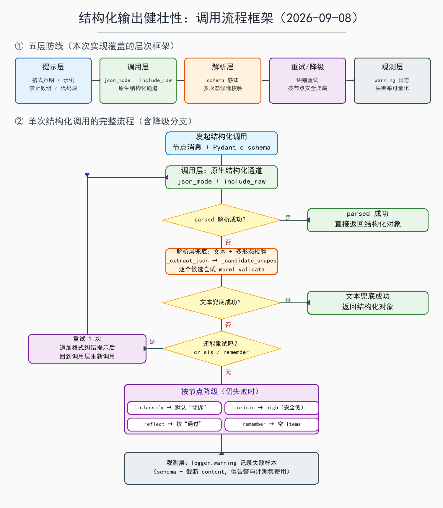

# 实施记录：结构化输出健壮性

> 日期：2026-09-08
> 关联方案：[结构化输出健壮性方案-v1](结构化输出健壮性方案-v1.md)
> 涉及范围：`WeTalk_v3/graph/nodes.py`、新增 `WeTalk_v3/scripts/smoke_structured_output.py`

## 〇、流程框架图

上半部分是本次实现覆盖的五层防线；下半部分是单次结构化调用的完整流程，
含"原生通道 → 文本兜底 → 重试 → 按节点降级 → 观测日志"的走向。

## 一、本次做了什么

按方案"先本地逻辑、再实验验证、后动调用层"的顺序实施：

1. **`_recent_context` 逐行注释**：把历史截断的两段逻辑（按轮数截断、按字符数丢最旧整轮）拆成逐行注释，纯可读性改动，无逻辑变化。
2. **解析器改为 schema 感知（修复 MemoryExtract 丢记忆 bug）**：
   - 新增 `_candidate_shapes`：按目标 Pydantic schema 生成候选载荷形态；
   - `_parse_model_json` 不再"见数组就取第一个"，而是逐个形态尝试 `model_validate`；
   - 修复场景：模型把多条记忆直接输出成顶层数组 `[{...}, ...]` 时，
     之前会取首元素后校验失败 → 返回 None → 记忆静默丢失；
     现在会包回 `{"items": [...]}` 正常解析。
3. **crisis_check 失败方向改为安全侧（fail-closed）**：解析失败由默认 `normal`
   改为默认 `high`——宁可误报进危机通道，也不让真实危机漏进普通倾诉。
4. **统一结构化调用入口 `_invoke_structured`**：`with_structured_output(
   method="json_mode", include_raw=True)` → 解析失败时对 `raw.content`
   走文本多形态兜底 → 可选带纠错提示重试一次 → 失败记 warning 日志并返回 None。
5. **四个节点迁移到新通道**（见下方降级策略表），删除不再使用的
   `_parse_reflection_response` 和 `StrOutputParser` 导入。
6. **四个结构化节点补格式声明**：json_mode 要求提示词显式声明"输出 JSON 对象"，
   统一追加了"只输出一个 JSON 对象 + 示例 + 禁止数组/代码块/解释"。
7. **新增冒烟测试脚本** `scripts/smoke_structured_output.py`，可重复执行。

## 二、冒烟测试结论（真实 API，qwen3.8-27b）

6 个场景 × 2 种通道，共 12 次真实调用：

| 通道 | 结果 | 失败场景 |
|---|---|---|
| json_mode | 6/6 成功 | 无 |
| function_calling | 5/6 成功 | "没有可提取内容"时模型直接输出文本 `{"items": []}` 而不发起工具调用 |

单次延迟约 1~5 秒。结论：**调用层采用 json_mode**，function_calling 留作备选；
空结果场景下模型输出纯文本，正好被文本容错解析兜住。

## 三、节点降级策略（本次落地）

| 节点 | schema | 重试 | 全部失败后的降级 |
|---|---|---|---|
| classify 意图判断 | Intent | 不重试（实时优先） | 默认"倾诉" |
| crisis_check 危机复核 | CrisisRisk | 重试 1 次 | 默认 high（安全侧） |
| reflect 质量自评 | Reflection | 不重试 | 按"通过"，避免无限重答 |
| remember 记忆提取 | MemoryExtract | 重试 1 次 | 空结果，不写记忆 |

## 四、验证情况

- 解析器离线用例 9/9 通过：Intent 数组包装、MemoryExtract 顶层数组、
  MemoryExtract 空数组、Intent 空数组、代码块、乱码、CrisisRisk、
  Reflection 数组包装、MemoryExtract 对象形态；
- `graph/nodes.py` 与冒烟脚本 AST 语法检查通过，模块导入正常；
- 冒烟脚本真实调用通过（见第二节）。

## 五、决策记录

1. **json_mode 优先于 function_calling**：function_calling 在"空结果"
   场景会漏调工具；json_mode 全场景稳定，且文本兜底链路可继续复用。
2. **crisis 用 fail-closed 折中**：方案稿建议的"需关注/人工复核"第三态
   需要给 `CrisisRisk` 和路由表加分支，本次未做，先用"失败按 high"
   保证不漏报；后续要做第三态需联动 `chat_graph.py` 路由。
3. **MemoryExtract 空数组语义**：`[]` 视为"没有可提取内容"（返回空 items），
   不算解析失败；`Intent` 等单对象 schema 的空数组仍算失败。

## 六、未完成 / 后续事项

- 观测层目前只有失败 warning 日志，缺阈值告警与"刁钻输入"评测集回归；
- 方案中的关键词语义兜底、Pydantic 软校验（`extra="ignore"` + 归一化
  validator）未做，属解析层增强；
- crisis "第三态"路由方案待定；
- 上线前建议把冒烟样本扩到 20~30 条跑一次完整回归；
- 冒烟脚本依赖真实 API 与 `.env` 密钥，不能进 CI 免费跑，只能手动回归。

## 七、涉及文件

- 修改：`WeTalk_v3/graph/nodes.py`
- 新增：`WeTalk_v3/scripts/smoke_structured_output.py`
- 新增：`WeTalk_v3/docs/images/实施记录-2026-09-08-流程框架图.png`（本文档配图）
- 新增：本文档
