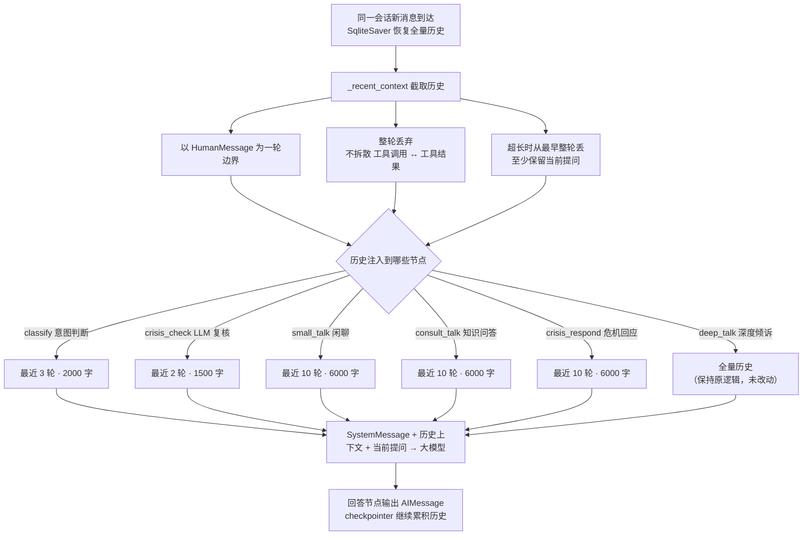

# WeTalk_v3 短期记忆优化方案 v1

> 本文只描述本次"让所有意图节点都能看到对话历史"的修改内容，不描述全局流程。
> 修改基于 WeTalk_v2 复制出的新版本 WeTalk_v3；长期记忆（store 读写、remember 节点仍只在深度倾诉之后触发）一律未动。

## 1. 目标

- 闲聊、求助、危机回应三个回答节点在生成回复前注入**最近 10 轮对话历史**；
- 意图分类、危机复核这两个"判断类"节点也参考少量前文，避免追问被误判；
- 修复同一会话内"我是谁""我刚才说的那个方法"等依赖前文才能回答的问题；
- 深度倾诉保持原有"全量历史"行为不变。

## 2. 修改点清单

| 节点 | 修改前 | 修改后 | 字符上限 |
|---|---|---|---|
| classify 意图判断 | 只看最新一句 | 注入最近 3 轮（含当前提问） | 2000 字 |
| crisis_check（LLM 复核） | 只看最新一句（关键词快检不变） | 注入最近 2 轮（含当前提问） | 1500 字 |
| small_talk 闲聊 | 只看最新一句 | 注入最近 10 轮（含当前提问） | 6000 字 |
| consult_talk 知识问答 | 只看最新一句 | 注入最近 10 轮（含当前提问） | 6000 字 |
| crisis_respond 危机回应 | 只看最新一句 | 注入最近 10 轮（含当前提问） | 6000 字 |
| deep_talk 深度倾诉 | 已传全量历史 | 不变 | 无 |
| reflect / remember / 长期记忆 | — | 不变 | — |

## 3. 实现位置

- `graph/nodes.py` 新增历史上下文工具：
  - `_recent_context(state, rounds, max_chars)`：从全量历史里截取"最近 rounds 轮"，含当前提问；
  - `_context_chars(messages)`：统计消息总字符数，供超长截断使用。
- `classify_node` / `crisis_check_node` / `crisis_respond_node` / `small_talk_node` / `consult_talk_node`
  由"ChatPromptTemplate 只传最新一句"改为"SystemMessage + 历史上下文列表"直接调用大模型。

## 4. 上下文截断规则

1. **以 HumanMessage 为一轮的分界**，按整轮截断；
2. **不拆散配对消息**：AI 的工具调用（`AIMessage.tool_calls`）与其结果（`ToolMessage`）永远同时保留或同时丢弃；
3. 先按轮数截断，再按字符预算**从最早的整轮开始丢弃**，至少保留"当前提问"这一轮；
4. 上下文**同时包含用户消息与助手回复**（"轮"= 一问一答），当前提问位于列表末尾，不再单独重复注入；
5. 截断后列表的第一条消息必然是用户消息，不会以孤立的工具结果开头。

## 5. 修改后的流程框架图（仅修改范围）

## 6. 验证情况

- `python -m py_compile graph/nodes.py` 通过；
- 本地断言验证通过：
  1. 12 轮历史只注入最近 10 轮，首尾均为用户消息；
  2. 超长历史按整轮丢弃至 6000 字以内，且至少保留当前提问；
  3. 含工具调用的历史截断后不会出现孤立的工具结果。
- **真实模型回归已跑通**（直接驱动 WeTalk_v3 的 LangGraph）：
  - 场景一：同一会话先说"我叫小周，今年24岁，在读研究生"，再问"我是谁？我是做什么的？"
    → 正确回答"你是小周呀，24岁，正在读研究生"，全程无崩溃；
  - 场景二：先倾诉"上周我和最好的朋友彻底闹翻了，我特别难过，晚上一直睡不着"，
    再追问"然后呢？"→ 追问被识别为**倾诉**（而非闲聊），继续走深度倾诉并给出延续性回应。

## 7. 运行中发现并修复的问题（v2 遗留隐患，顺手修复）

- **现象**：千问模型偶尔会把结构化输出包成数组（如 `[{"intent": "倾诉"}]`），
  `with_structured_output` 直接校验崩溃，整次对话请求失败；
- **修复**：`classify_node`、`crisis_check_node`（LLM 复核）、`remember_node`
  三个使用结构化输出的节点改为"文本输出 + 容错解析"（复用现有 `_extract_json`，
  兼容数组 / 代码块 / 前后缀文字），并带失败兜底：
  - 意图判断解析失败 → 默认按"倾诉"处理（走深度倾诉，而不是让请求崩溃）；
  - 危机复核解析失败 → 默认 `normal`（关键词快检仍能兜住明显危机词）；
  - 记忆提取解析失败 → 不写入任何记忆；
- **影响**：只改解析健壮性，不改业务逻辑；`remember_node` 仍只在深度倾诉之后触发。
  v2 同样存在此隐患，如需可在后续一并修复。

## 8. 本轮明确不做

- 长期记忆的读取与写入逻辑（含"跨会话的我是谁"）不动；
- `remember_node` 仍只在深度倾诉路径结束后触发；
- 知识库检索、危机关键词快检、前端页面均未改动。
