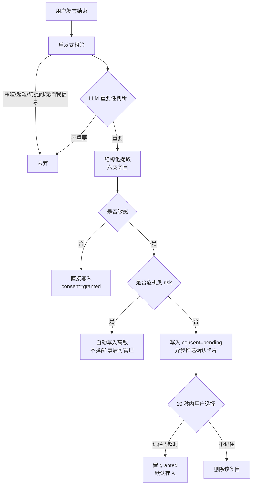

# 长期记忆：内容与存储方案 v1（待确认稿）

> 范围：确定长期记忆**存什么内容、用什么格式存、什么才值得存**。
> 为后续"记忆注入、用户自画像、故事图"打数据基础。
> 本稿只做设计定稿，不含代码实现；确认后另行拆分实现模块。

---

## 1. 内容分类（六大类，已确认）

| 类型 | 存什么 | 更新方式 | 主要消费者 |
|---|---|---|---|
| profile 身份档案 | 称呼、年龄、职业/学业、所在地、家庭结构等静态信息 | 固定字段，新值覆盖旧值 | 自画像、记忆注入（如"我是谁"） |
| event 人生事件 | 用户倾诉/提到的重要事情，含时间、主题、情绪、影响、状态 | 追加，不覆盖 | 故事图 |
| emotion_state 情绪状态 | 持续/反复出现的状态（长期失眠、持续焦虑等） | 同主题更新，新主题追加 | 自画像 |
| preference 偏好与应对 | 喜好、习惯、价值观、遇到困难时的应对方式 | 去重后追加 | 自画像 |
| session_note 会话小结 | 倾诉结束后生成的叙事摘要（生成逻辑已搁置，格式先预留） | 追加 | 故事图、跨会话回忆 |
| risk 风险记录 | 危机相关内容（自伤/自杀倾向等） | 追加，自动高敏 | 安全响应 |

### 1.1 什么值得存（示例）

**存：**
- "我叫小周，今年24岁" → profile
- "上个月和室友吵得很凶，最近一直睡不好" → event + emotion_state
- "压力大的时候我会去操场跑圈" → preference
- "最近两周每天凌晨三点还醒着" → emotion_state
- 倾诉中出现自伤/轻生表达 → risk

**不存：**
- 纯知识问答（"失眠怎么缓解？"——没有个人事实）
- 寒暄/超短回应（"哈哈哈""好的"）
- 一次性情绪（"今天有点烦"——无持续性、无事件支撑）
- 与用户本人无关的第三人琐事
- 用户明确表示不要记住的内容

---

## 2. 存储格式

### 2.1 命名空间与 key 规则

沿用现有 SqliteStore，按类目拆分子命名空间：

| 命名空间 `(user_id, "memory", …)` | key 规则 | 说明 |
|---|---|---|
| `"profile"` | 固定字段名，如 `称呼`、`年龄` | 新值覆盖旧值 |
| `"events"` | `ev_<随机ID>` | 只追加 |
| `"states"` | `st_<随机ID>` | 追加；同主题更新时复用原 key |
| `"preferences"` | `pf_<随机ID>` | 追加；去重后写 |
| `"notes"` | `sn_<日期>_<随机ID>` | 追加（预留） |
| `"risks"` | `rk_<随机ID>` | 只追加，自动高敏 |

### 2.2 每条记忆的通用字段

| 字段 | 说明 |
|---|---|
| `id` | 唯一 ID（与 key 相同） |
| `type` | 六类之一：profile / event / emotion_state / preference / session_note / risk |
| `content` | 内容摘要（LLM 提炼，供注入与展示） |
| `sensitivity` | `normal` / `high` |
| `consent` | `granted` / `pending`。普通条目直接 granted；高敏条目写入时 pending，确认或 10 秒超时后置 granted |
| `source` | `chat` / `session_note` / `import` |
| `created_at` | 写入时间（ISO） |
| `updated_at` | 最近更新时间 |
| `expires_at` | 可选；保留期策略未定，字段先预留 |

### 2.3 各类专属字段

| 类型 | 专属字段 |
|---|---|
| event | `when`（归一化时间）、`when_raw`（用户原话）、`topic[]`、`emotion[]`、`impact`(1-5 可空)、`status`(进行中/已缓解/已解决/未知) |
| emotion_state | `since`（大概起始）、`last_seen`、`status`(active/improving/resolved) |
| preference | `aspect`（偏好/价值观/应对方式/目标） |
| risk | `occurred_when`、`risk_level`、`status`(active/followed_up/resolved) |
| session_note（预留） | `summary`、`topics[]`、`user_state`、`progress`、`follow_up` |

### 2.4 JSON 示例

**event（故事图主数据源）：**

```json
{
  "id": "ev_9f3c2a1b",
  "type": "event",
  "content": "和室友因作息问题频繁争吵",
  "when": "2026-08",
  "when_raw": "上个月",
  "topic": ["人际冲突", "学业生活"],
  "emotion": ["烦躁", "委屈"],
  "impact": 3,
  "status": "进行中",
  "sensitivity": "normal",
  "consent": "granted",
  "source": "chat",
  "created_at": "2026-09-07T10:00:00",
  "updated_at": "2026-09-07T10:00:00"
}
```

**profile（固定字段覆盖式）：**

```json
{
  "id": "称呼",
  "type": "profile",
  "content": "小周",
  "sensitivity": "normal",
  "consent": "granted",
  "source": "chat",
  "created_at": "2026-09-07T10:00:00",
  "updated_at": "2026-09-08T09:30:00"
}
```

**emotion_state（同主题复用/更新）：**

```json
{
  "id": "st_7d1e04f9",
  "type": "emotion_state",
  "content": "入睡困难，凌晨两三点才睡着",
  "since": "2026-08",
  "last_seen": "2026-09-07",
  "status": "active",
  "sensitivity": "normal",
  "consent": "granted",
  "source": "chat",
  "created_at": "2026-09-01T19:32:00",
  "updated_at": "2026-09-07T10:00:00"
}
```

---

## 3. 时间归一化规则（已确认：保留模糊值并归一化）

锚点 = 服务端当前日期（例如 2026-09-07）。规则：

| 用户原话 | 归一化 `when` | 示例 |
|---|---|---|
| 今天 / 今晚 | `YYYY-MM-DD` | `2026-09-07` |
| 昨天 / 前天 | `YYYY-MM-DD` | `2026-09-06` / `2026-09-05` |
| 这周 / 这个月 | `YYYY-MM` | `2026-09` |
| 上周 / 上个月 | 周起始日 / `YYYY-MM` | `2026-08`（上个月） |
| 上上个月 | `YYYY-MM` | `2026-07` |
| 今年 | `YYYY` | `2026` |
| 去年 / 前年 | `YYYY` | `2025` / `2024` |
| N 年前 | `YYYY` | `2024` |
| 几个月前 / 上半年 | `YYYY-MM` 或 `YYYY` | LLM 结合上下文推算 |
| 小时候 / 大学时 / 工作后 | `when=null`，阶段词保留在 `when_raw` | — |
| 未提及时间 | `when=null` | — |

约定：
1. `when` 只允许 `YYYY` / `YYYY-MM` / `YYYY-MM-DD` 三种粒度；
2. `when_raw` 始终保留用户原话（如"上个月"），两者不冲突；
3. 故事图排序用 `when`，缺失时后续用 `created_at` 兜底并标注"时间不详"（属于展示逻辑，后续实现）。

---

## 4. 写入门控流程（已确认：重要 → 敏感 → 确认）



### 4.1 确认卡片的交互约定（不影响用户体验）

- 卡片在**助手回答完整输出之后**异步出现，不打断回复、不阻塞对话；
- 文案示例："我建议记住：**24岁，研二**。这样下次我能更好地帮你。是否存入？" 按钮：`记住` / `不记住`，附 10 秒倒计时；
- 10 秒未操作 → 默认存入（按已确认规则）；
- 后续实现需两个接口：SSE 追加 `memory_confirm` 事件 + `POST /api/memory/decide {memory_id, action: keep|discard}`；
- 同一内容已存在且为 granted 时，不再重复弹窗。

### 4.2 危机场景例外（本稿新增建议，需你确认）

用户处于危机（自伤/自杀表达）时**不弹任何确认卡片**：
- 危机场景不适合打断用户、或让用户做选择题；
- risk 条目自动写入（sensitivity=high、consent=granted），安全优先；
- 数据在后续"自画像/记忆管理"中向用户可见、可删除。

### 4.3 重要性判断的两级设计

1. **启发式粗筛（免费）**：文本过短、命中寒暄表、明显纯知识提问 → 直接跳过，省一次 LLM 调用；
2. **LLM 判断**：内容是否与用户本人相关 + 是否具备长期/重要价值；有才进入结构化提取。

---

## 5. 高敏内容判定清单（命中即 sensitivity=high）

- 疾病诊断、精神科就诊/用药、住院史
- 创伤 / 虐待 / 家暴经历细节
- 自杀、自伤、危机表达（归 risk 类，按 4.2 不弹窗）
- 性侵、性相关创伤
- 收入、负债等财务信息
- 真实身份信息（身份证号、电话、住址、单位）
- 违法犯罪相关
- 用户明确强调"别说出去"的内容

除 risk 外，命中高敏即走确认卡片流程（4.1）。

---

## 6. 去重与更新规则

| 类型 | 规则 |
|---|---|
| profile | 同字段已存在 → 覆盖更新；内容相同 → 跳过不写 |
| event | 完全重复 → 跳过；同一事件的**新进展** → 追加为新事件（保留原事件，故事图展示连续进展）；用户更正事实（时间/人物说错）→ 更新原条目 |
| emotion_state | 同主题且仍 active → 更新原条目的 `last_seen`/缓解状态；新主题 → 追加 |
| preference | 语义近似 → 合并或跳过 |
| risk | 同类危机再次出现 → 追加新记录（保留历史） |

统一前置规则：写入前检查"同内容是否已存在且 granted"，避免同一敏感信息反复弹窗。

---

## 7. 读取约定（给后续模块的接口约束）

- 按命名空间前缀读取对应类目；
- 排序规则：event 按 `when` 降序（缺失兜底）、emotion_state 优先 active、其余按 `updated_at`；
- **自画像消费**：profile（当前值）+ emotion_state（active）+ preference；
- **故事图消费**：event（时间轴）+ session_note（预留）；
- 深度倾诉的记忆注入后续改为读取结构化条目，注入方案另行设计。

---

## 8. 存量数据迁移

旧数据：命名空间 `(user_id, "memory")`，key=类别（背景/情绪/经历/偏好），value 只有 `content`+`timestamp`。

迁移方案：启动后跑一次性迁移脚本，逐条由 LLM 重新归类为六类并补齐字段；失败的条目移入 `(user_id, "memory", "legacy")` 保留，旧读取逻辑兼容展示。本地测试数据量小，开销可接受。

---

## 9. 待定项（不影响本稿主体，确认后生效）

1. **保留期限策略**：`expires_at` 字段已预留，v1 默认不自动过期。是否对情绪状态设 90 天、风险记录保留多久，待产品确认；
2. **session_note 会话小结**：生成时机与判断逻辑已搁置，仅预留格式；
3. **risk 条目**：是否开放用户查看与删除（建议开放，联动自画像页）；
4. **危机场景例外（4.2）**：是否认可"危机不弹窗、自动高敏记录"。
